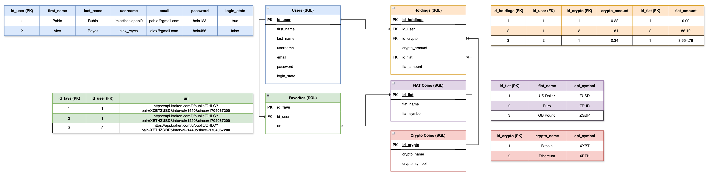

# TradeBoyAI

## Overview

TradeBoyAI is a cutting-edge web application designed for cryptocurrency enthusiasts and traders. It offers real-time data, insightful analytics, and visualizations to help users make informed trading decisions. Powered by AI, TradeBoyAI aims to revolutionize the way you trade by providing lightning-fast market prices, asset tracking, and predictive trading suggestions.

## Features

- **Real-Time Cryptocurrency Data:** Access the latest market prices and trends without delay.
- **Candlestick Charts:** Visualize price movements with customizable candlestick charts dating back up to 2 years.
- **Portfolio Management:** Easily track your cryptocurrency assets and monitor your investment performance.
- **Mobile Friendly:** Trade on the go with our responsive design that adapts to your mobile device.

## How to Use

1. **Chart Customization:** Customize your charts to display the data you need. Select cryptocurrency pairs, time frames, and chart lengths using the dropdown menus.
2. **Account Creation:** Create an account to save your favorite chart views and manage your portfolio.
3. **Manage your assets:** Get a taste of how you would be able to manage your assets with our app, through the implementation of smart graphics with the ApexCharts library.

## Creating an Account

- Navigate to the "My Account" page from the header or footer links.
- Choose to either log in with an existing account or create a new one.
- Follow the prompts to enter your email and password.

## Technical Details

- **Front-End:** The Single-Page-Application is built with **Vite** and **React.js**.
- **Back-End:** The back-end support of the application is built with **PostgreSQL** and deployed with **Docker** locally. Check out the `database.sql` file to see how the tables were created and with which specifications. You will also find the necessary SQL queries inside the models folder at `pabl0-full-stack-project/server/models`.

- **Libraries and APIs:**
  - `React.js` for handling the front-end of the application.
  - `js-datepicker` for selecting dates.
  - `ApexCharts` for rendering candlestick charts.
  - `PostgreSQL` for database services such as login, account creation and user holdings.

- **Styling:**
  - `Sass` for enabling easy-to-use styling accross components.

## SQL Entity Relationship Diagram + Table Examples



## Getting Started

To get started with the TradeBoyAI, follow these steps:

1. Clone this repository to your local machine:

   ```bash
   git clone https://github.com/imisstheoldpabl0/pabl0-full-stack-project
   ```

2. Navigate to the project directory (`main` branch):

   ```bash
   cd pabl0-full-stack-project
   ```

3. Navigate to the `client` folder and run the project to see the front-end version:

    ```bash
    cd client
    npm run dev
    ```

## Future Implementations

- **AI Trading Suggestions:** Leverage advanced AI technology for predictive trading insights with a ML model deployed through Amazon's EC2.
- **Better Date Picking:** Due to restricted date-picking  for fetching OHLC prices through the Kraken API, expect a better implementation and date-choosing features in the next update(s).

## License

This project is licensed under the MIT License - see the LICENSE file for details.
